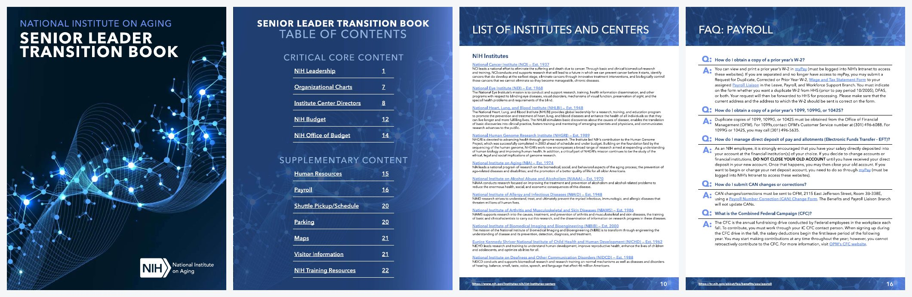

# Senior Leader Transition Book: case study and link-rot audit

A four-volume onboarding guide I designed and built in Adobe InDesign for incoming
senior leaders at the NIH National Institute on Aging (NIA), plus a Python tool
that audits how the book's links and leadership content have aged since I left.

> **Snapshot, not maintained.** The book reflects nih.gov as of its publication date.
> Names, org charts, and links are shown as they were then. I no longer work at NIH
> and this repository is not an official NIH resource.



---

## The problem

New senior leaders at NIA had to piece together who ran what, how the budget
worked, and how to handle HR and payroll from dozens of separate nih.gov and
intranet pages. There was no single place to start.

## What I built

| | |
|---|---|
| **Format** | 4 volumes, designed in Adobe InDesign, distributed as PDF |
| **Structure** | Critical core content (leadership, org charts, IC directors, budget, Office of Budget) up front; supplementary content (HR, payroll, shuttle, parking, maps, visitors, training) behind it |
| **Design system** | Consistent page template: section banner, source URL in every footer, page number, linked anchor text for every referenced office or form |
| **Traceability** | Every page cites the nih.gov page its content came from, so readers can check anything against the source |
| **My role** | <!-- EDIT: e.g. "Sole designer and content lead. Scoped content with the Deputy Director's office, ..." --> |
| **Audience / use** | <!-- EDIT: who received it, how many leaders onboarded with it, any feedback --> |

### Volumes

| Volume | Contents |
|---|---|
| 1 | NIH leadership, organization, IC directors, budget, Office of Budget, HR contacts, payroll FAQ, visitor info, training |
| 2 | <!-- EDIT --> |
| 3 | <!-- EDIT --> |
| 4 | <!-- EDIT --> |

---

## The audit tool

Documents full of links decay. This repo includes `linkcheck`, a small Python
package that measures that decay.

**What it does**

1. **Extracts every URL from a PDF**, three ways: clickable link annotations
   (exact), the text layer, and **OCR for flattened PDFs**. The Volume 1 copy I
   had was printed through "Microsoft Print to PDF", so every page is an image.
   OCR, plus a second pass that inverts the white-on-blue footer band, recovered
   all 22 footer source URLs with zero errors.
2. **Checks each URL** (HEAD with GET fallback, redirects followed) and classifies
   it: `OK`, `REDIRECT`, `SOFT_404` (a deep link that now lands on a homepage),
   `RESTRICTED` (401/403, often intranet-only), `BROKEN`, or `ERROR`.
3. **Compares the leadership roster** in the book with the current nih.gov roster
   and reports who has changed (`linkcheck.drift`).
4. **Runs monthly in GitHub Actions** against a saved URL inventory, so the PDFs
   never need to be in the repo, and commits the updated report.

### First-run findings (Volume 1, 2026-09-30)

- nih.gov moved `/about-nih/who-we-are/` and `/about-nih/what-we-do/` under
  `/about-nih/organization/`. That one restructuring affects **8 of 22** content pages.
- **22 of 33** named leadership positions (67%) now have a different person,
  including the NIH Director, 4 of 5 Deputy Directors, and 17 of 27 IC directors.
- About 200 hyperlinks on anchor text could not be audited because the PDF was
  flattened. A re-export from InDesign as *Adobe PDF (Interactive)* fixes that.

Details: [reports/2026-09-30-first-run.md](reports/2026-09-30-first-run.md) ·
[reports/leadership-drift.md](reports/leadership-drift.md) ·
[reports/report.md](reports/report.md) (updated by CI)

### Run it yourself

```bash
pip install -r requirements.txt
sudo apt-get install tesseract-ocr poppler-utils   # only needed for image-only PDFs

# Scan PDFs, check links, save the URL inventory for CI
python -m linkcheck volumes/*.pdf --save-inventory data/links-inventory.csv

# Re-check the saved inventory (what CI runs)
python -m linkcheck --inventory data/links-inventory.csv

# Leadership drift
python -m linkcheck.drift data/vol1-leadership.csv

# Tests
python -m pytest -q
```

Output lands in `reports/`: `links.csv` (one row per link per page) and
`report.md` (summary plus detail table).

### Repository layout

```
linkcheck/        extract.py (annotations, text, OCR) · check.py (HTTP + classify)
                  report.py (CSV/Markdown) · drift.py (roster comparison) · cli.py
data/             links-inventory.csv (URLs found per page) · vol1-leadership.csv
reports/          generated audit reports
tests/            unit tests + an end-to-end OCR test that runs when the PDF is present
volumes/          PDFs go here locally (git-ignored, see volumes/README.md)
.github/workflows monthly link audit
```

## Skills shown

Program and content management (scoping, stakeholder sourcing, information
architecture) · InDesign layout and a reusable page system · Python, OCR, HTTP
automation, and data comparison · CI/CD with scheduled GitHub Actions.

## Possible next steps

- Re-export all four volumes as interactive PDFs and audit every anchor link.
- Move the monthly check to an Azure Function on a timer trigger, with results
  written to Blob Storage and a Power BI or static dashboard.
